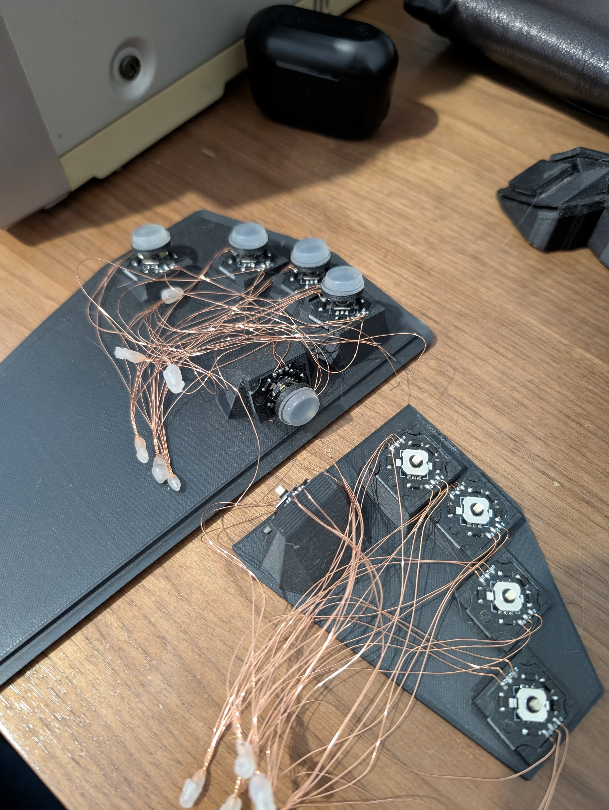

# Skyl
This is a prototype for a dactyl like keyboard mounting SKRHADE010 switches.

I abandoned this project after mounting the first prototype as I felt the switches to be
too stiff for my taste. In my opinion the downward motion is only usable on the index and thumb
finger, and the pinky is almost useless. For context, I use Cherry ULPs that are already fairly stiff.

This is posted to allow whoever wants to continue and experiment with it :D

The PCBs used in the project can be found here: [skrhade_single_pcb](https://github.com/jonboh/skrhade_singlepcb).
The pcb design is far from optimal, please see the comments in the pcb repo if you want to improve on the wiring of this project.

This project was initially inspired by [harite](https://github.com/dlip/harite), if you want a fully
functioning keyboard project check it out.
